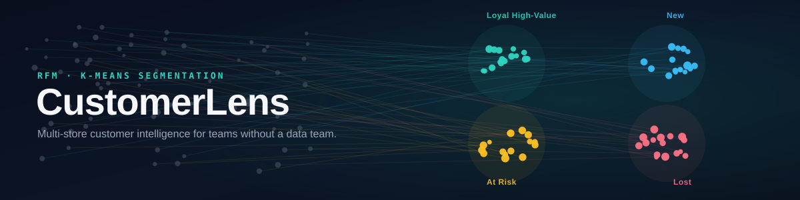
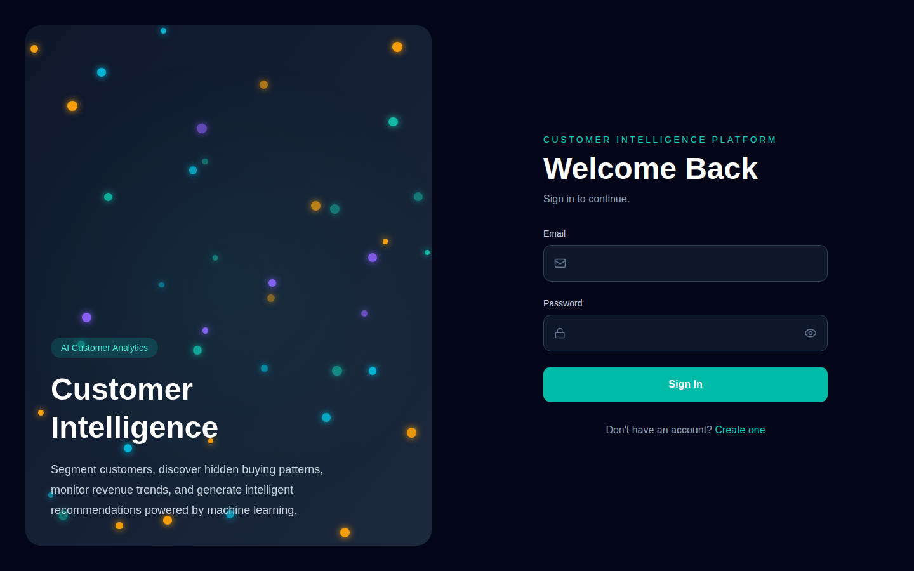
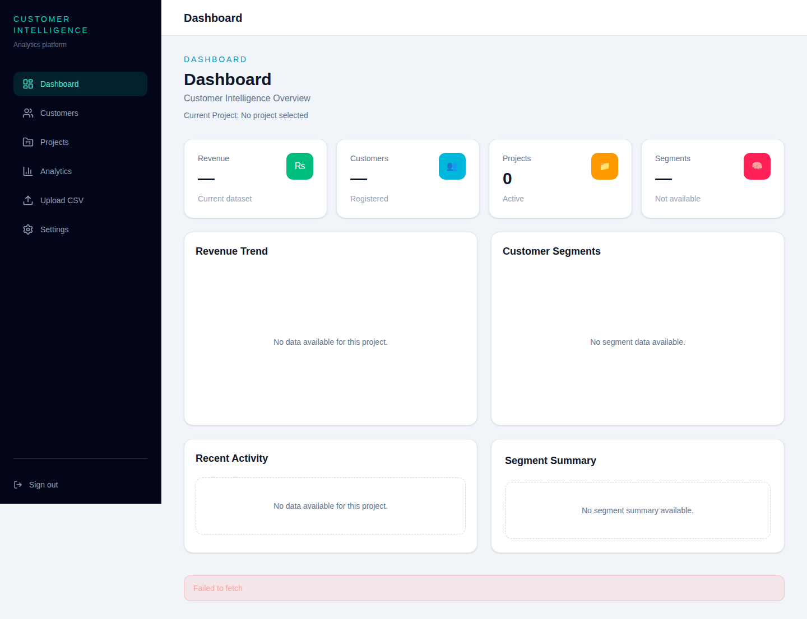
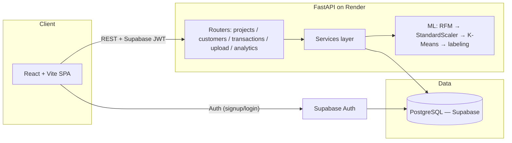

<p align="center">
  
</p>

<div align="center">

[](./LICENSE)
[](https://github.com/Despectinator/customer-intelligence-platform/actions/workflows/backend-tests.yml)
[](https://customer-intelligence-platform-three.vercel.app)


**[Live Demo](https://customer-intelligence-platform-three.vercel.app)** · **[API Reference](./docs/api/API-Design.md)** · **[Architecture](./docs/architecture/System-Architecture.md)** · **[Report a Bug](../../issues)**

</div>

<br>

## What it does

Upload a store's transaction history as a CSV. CustomerLens computes **Recency, Frequency, and Monetary (RFM)** value for every customer, then runs **K-Means clustering** on those metrics to sort customers into four plain-language segments — **Loyal High-Value, New, At Risk, Lost** — each paired with a retention recommendation. Add a transaction, edit a customer, or upload a new CSV, and segments recompute automatically; every shift is logged to a migration timeline, so the dashboard stays current without any streaming infrastructure.

It's built for people managing more than one store or client: each **Project** is an isolated workspace with its own customers, transactions, and segmentation.

## Features

| | |
|---|---|
| 🔐 **Auth** | Supabase-backed signup/login, route-guarded dashboard |
| 🗂️ **Multi-tenant projects** | One workspace per store, brand, or client |
| 📤 **CSV import** | Bulk transaction upload with duplicate detection, in-file and cross-upload |
| 📊 **Live RFM + K-Means** | Recomputed automatically on every relevant data change — never stale |
| 🕒 **Segment history** | Every migration (e.g. *At Risk → Loyal*) logged and shown as a timeline |
| 💡 **Recommendations** | Plain-language retention guidance per segment |
| 📈 **Analytics dashboard** | KPIs, revenue trend, segment breakdown, recent activity |
| 🛡️ **Hardened errors** | Generic responses in production, full detail only in `DEBUG` mode |

## Screenshots

<table>
<tr>
<td width="50%"></td>
<td width="50%"></td>
</tr>
<tr>
<td align="center"><sub>Sign in</sub></td>
<td align="center"><sub>Dashboard</sub></td>
</tr>
</table>

> The dashboard screenshot above shows the empty state. Swap `docs/images/dashboard.png` for a screenshot taken with a project that has real data loaded — segment charts and KPIs are far more convincing populated.

## Tech Stack

| Layer | Technology |
|---|---|
| Frontend | React (Vite), Tailwind CSS, React Router, Recharts |
| Backend | FastAPI (Python), SQLAlchemy |
| Database & Auth | PostgreSQL + Supabase Authentication |
| Machine Learning | scikit-learn (K-Means, StandardScaler), pandas, NumPy |
| Deployment | Render (backend), Vercel (frontend) |
| Testing | pytest |

## Architecture



RFM values are **never persisted** — they're recalculated on demand from `transactions` so they can't go stale. Only the clustering *result* (current segment) and its change history are cached. Full write-up, including the ER diagram and CSV-upload flow, is in [`docs/`](./docs).

## Project Structure

```
customer-intelligence-platform/
├── backend/            # FastAPI app (routes, services, ML, tests)
│   └── app/
│       ├── api/routes/      # Thin route handlers
│       ├── services/        # Business logic
│       ├── ml/               # RFM, clustering, labeling
│       ├── database/models/  # SQLAlchemy models
│       └── exceptions/       # Global error handling
├── frontend/           # React (Vite) SPA
│   └── src/
│       ├── pages/            # Dashboard, Projects, Customers, Analytics, Upload...
│       ├── services/         # API client layer
│       └── context/          # Auth + active-project context
├── database/           # schema.sql, migrations
└── docs/                # Architecture, API reference, planning docs — see docs/README.md
```

## Getting Started

<details>
<summary><strong>Prerequisites</strong></summary>
<br>

- Node.js 18+
- Python 3.12+
- A [Supabase](https://supabase.com) project (PostgreSQL + Auth)

</details>

<details open>
<summary><strong>Backend</strong></summary>

```bash
cd backend
python -m venv venv
source venv/bin/activate        # Windows: venv\Scripts\activate
pip install -r requirements.txt
cp .env.example .env            # fill in your Supabase credentials
uvicorn app.main:app --reload
```
Swagger UI at `http://127.0.0.1:8000/docs`. More detail in [`backend/README.md`](./backend/README.md).
</details>

<details open>
<summary><strong>Frontend</strong></summary>

```bash
cd frontend
npm install
cp .env.example .env            # set VITE_API_BASE_URL and Supabase keys
npm run dev
```
</details>

<details>
<summary><strong>Database</strong></summary>
<br>

Run [`database/schema.sql`](./database/schema.sql) in the Supabase SQL editor to create all tables.
</details>

<details>
<summary><strong>Tests</strong></summary>
<br>

```bash
cd backend && pytest
```
</details>

## Roadmap

- [ ] Configurable cluster count / business-defined thresholds for non-default customer bases
- [ ] End-to-end (frontend + backend) test coverage
- [ ] Background processing for large CSV uploads
- [ ] Seeded public demo project for reviewers

Full original plan in [`docs/planning/Roadmap.md`](./docs/planning/Roadmap.md).

## License

Distributed under the [MIT License](./LICENSE).
