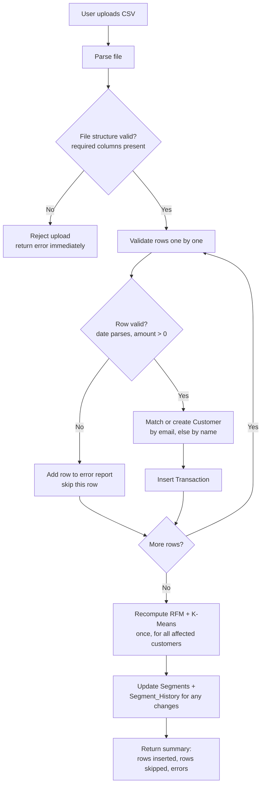

# CSV Upload Flow

## Overview

Users can bulk-import customer and transaction data into a project via CSV, instead of entering records one at a time through the UI. This is the primary way real transactional datasets (e.g. Online Retail II) get seeded into a project, and it's what keeps the "no dummy data" requirement genuine — the data enters through the same feature a real user would use.

Endpoint: `POST /projects/{project_id}/transactions/upload-csv`

## Expected CSV columns

| Column | Required | Notes |
|---|---|---|
| customer_name | Yes | Used to match an existing customer or create a new one |
| email | No | If present, used as the primary match key (preferred over name) |
| order_date | Yes | Must parse to a valid date |
| order_amount | Yes | Must be a positive number |
| payment_method | No | |

## Flow



## Key design decisions

- **Validation is per-row, not all-or-nothing.** A CSV with a few malformed rows still imports the valid ones; invalid rows are reported back to the user with a reason (e.g. "row 47: order_amount is not a number"), rather than rejecting the entire file.
- **Segmentation recomputes once per upload, not once per row.** Re-running K-Means after every single inserted row would be wasteful for a file with hundreds or thousands of rows. Instead, the backend collects the set of affected customers during the upload, then runs one batch recompute at the end.
- **Customer matching prevents duplicates.** If a customer with the same email (or name, if no email) already exists in the project, new rows are attached to that existing customer rather than creating a duplicate.

## Response format

```json
{
  "success": true,
  "data": {
    "customers_created": 12,
    "transactions_inserted": 340,
    "rows_skipped": 3,
    "errors": [
      { "row": 47, "reason": "order_amount is not a number" },
      { "row": 112, "reason": "order_date could not be parsed" }
    ]
  }
}
```
