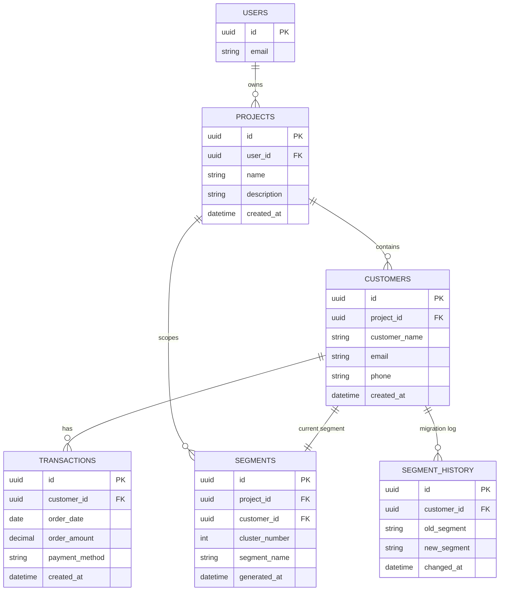

# Entity Relationship Diagram (ERD)

## Overview

The Customer Intelligence Platform follows a relational database design. Authentication is managed by Supabase Auth. RFM values are never stored — only the clustering result (`Segments`) and its change history (`Segment_History`) are persisted.

---

## Relationship Summary

- One authenticated user can own multiple projects.
- One project can contain multiple customers, and scopes its own set of segment records.
- One customer can have multiple transactions — this is the only source RFM values are ever calculated from.
- One customer has exactly one current segment record (1:1), overwritten whenever clustering is recomputed.
- One customer can have multiple segment history entries — an append-only log of every time their segment changed, used to power the real-time migration feed on the dashboard.
