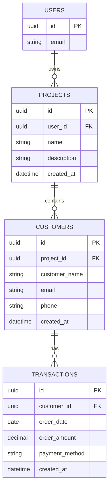

# Entity Relationship Diagram (ERD)

## Overview

The Customer Intelligence Platform follows a relational database design. Authentication is managed by Supabase Auth, while application-specific data is stored in PostgreSQL.

---

## Relationship Summary

- One authenticated user can own multiple projects.
- One project can contain multiple customers.
- One customer can have multiple transactions.
- Customer segmentation is calculated dynamically from transaction history using RFM analysis and K-Means clustering.