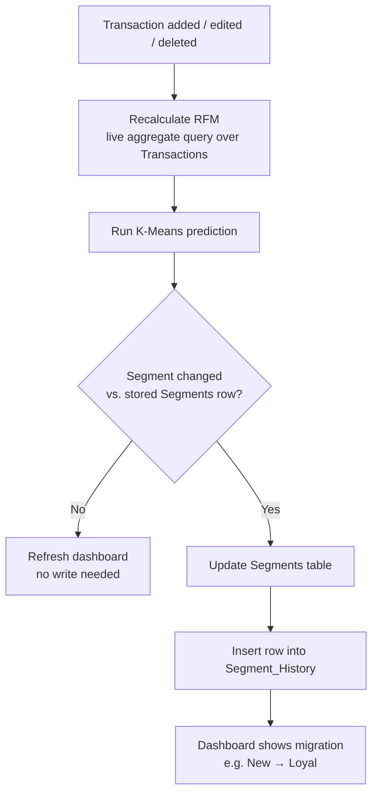

# System Architecture

## Overview

The Customer Intelligence Platform follows a three-tier architecture consisting of:

- Presentation Layer (React)
- Application Layer (FastAPI)
- Data Layer (PostgreSQL)

The machine learning module integrates with the backend to calculate RFM metrics and perform customer segmentation using K-Means clustering.

## Technology Stack

- Frontend: React + Vite + Tailwind CSS
- Backend: FastAPI
- Authentication: Supabase Auth
- Database: PostgreSQL (Supabase)
- Machine Learning: Scikit-learn
- Data Processing: Pandas & NumPy
- Charts: Recharts
- Frontend Deployment: Vercel
- Backend Deployment: Render

## Architecture Principles

- RESTful API communication
- Modular backend design
- Secure authentication (handled by Supabase, not the backend)
- RFM values are always derived, never stored
- Only the clustering result is cached, and only recomputed when relevant data changes
- Responsive dashboard

---

## Analytics Flow

This is the core mechanic that gives the dashboard its "live" feel without any streaming infrastructure.

In practice: a customer moves from "New Customer" to "Loyal Customer" the moment their transaction history crosses a threshold. The change is detected immediately after the triggering write, recorded once, and surfaced on the dashboard — rather than being discovered on some future scheduled batch job.

## CSV Bulk Import Flow

Bulk data entry (importing an existing transaction dataset) follows a related but distinct flow — see [`CSV-Upload-Flow.md`](./CSV-Upload-Flow.md) for full detail. In short: rows are validated and inserted individually, but the RFM/K-Means recompute above runs once per upload rather than once per row, to avoid re-clustering the entire customer base hundreds of times during a single import.
